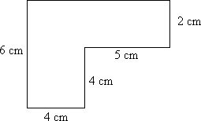
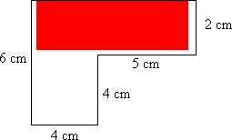
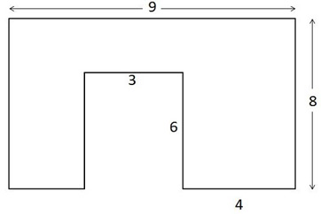
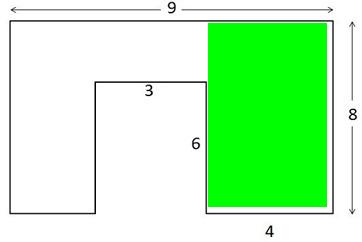
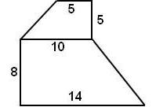
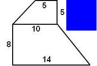
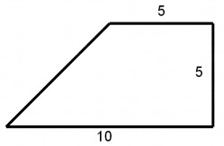
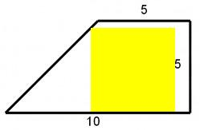
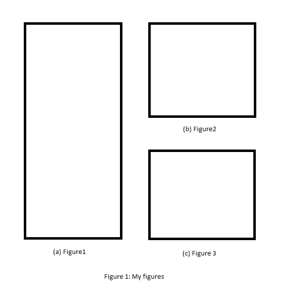
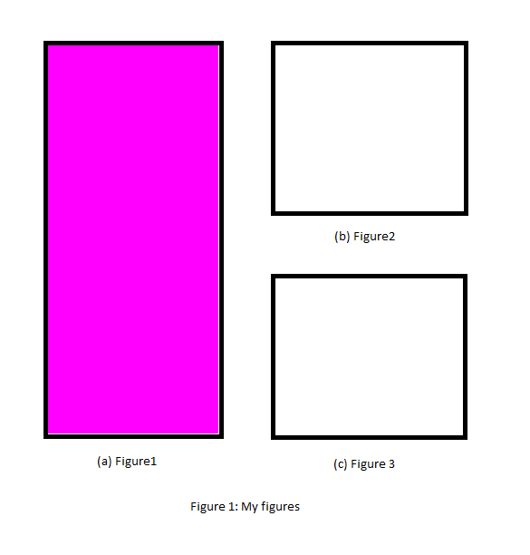

# Примеры:

## Пример 1

<kbd></kbd>

```bash
$ python maxempty/rect.py -i tests/input-figure-1.jpg -o tests/output-figure-1.jpg -f 255,0,0 -e 255,255,255
(9240, [(1, 40, 55, 207)])
```

<kbd></kbd>

## Пример 2

<kbd></kbd>

```bash
$ python maxempty/rect.py --input tests/input-figure-2.jpg --output tests/output-figure-2.jpg --fill 0,255,0 --empty 255,255,255
(22200, [(23, 208, 207, 327)])
```

<kbd></kbd>

## Пример 3

<kbd></kbd>

```bash
$ python maxempty/rect.py -i tests/input-figure-3.jpg -o tests/output-figure-3.jpg -f 0,0,255 -e 255,255,255
(4032, [(0, 136, 63, 198)])
```

<kbd></kbd>

## Пример 4

<kbd></kbd>

```bash
$ python maxempty/rect.py --input tests/input-figure-4.jpg --output tests/output-figure-4.jpg --fill 255,255,0 --busy 0,0,0
(11236, [(35, 113, 140, 218)])
```

<kbd></kbd>

## Пример 5

<kbd></kbd>

```bash
$ python maxempty/rect.py -i tests/input-figure-5.png -o tests/output-figure-5.png -f 255,0,255 -e 255,255,255
(81081, [(50, 53, 478, 241)])
```

<kbd></kbd>

# Ссылки

Largest empty rectangle:

- [en.wikipedia.org/wiki/Largest_empty_rectangle](https://en.wikipedia.org/wiki/Largest_empty_rectangle)
- [stackoverflow.com/questions/2478447/find-largest-rectangle-containing-only-zeros-in-an-n×n-binary-matrix](http://stackoverflow.com/a/30418912/2289640)

Python:

- [docs.python.org/3.3/library/stdtypes.html#printf-style-string-formatting](https://docs.python.org/3.3/library/stdtypes.html#printf-style-string-formatting)
- [stackoverflow.com/questions/6393861/how-python-deals-with-module-and-package-having-the-same-name](https://stackoverflow.com/questions/6393861/how-python-deals-with-module-and-package-having-the-same-name)

PIL:

- [en.wikibooks.org/wiki/Python_Imaging_Library/Editing_Pixels](https://en.wikibooks.org/wiki/Python_Imaging_Library/Editing_Pixels)
- [stackoverflow.com/questions/8032642/how-to-obtain-image-size-using-standard-python-class-without-using-external-lib](http://stackoverflow.com/a/8033053/2289640)
- [pillow.readthedocs.io/en/3.4.x/reference/Image.html#PIL.Image.Image.convert](http://pillow.readthedocs.io/en/3.4.x/reference/Image.html#PIL.Image.Image.convert)
- [stackoverflow.com/questions/12201577/how-can-i-convert-an-rgb-image-into-grayscale-in-python](https://stackoverflow.com/a/12201744/2289640)

NumPy:

- [docs.scipy.org/doc/numpy/reference/generated/numpy.zeros.html](https://docs.scipy.org/doc/numpy/reference/generated/numpy.zeros.html)
